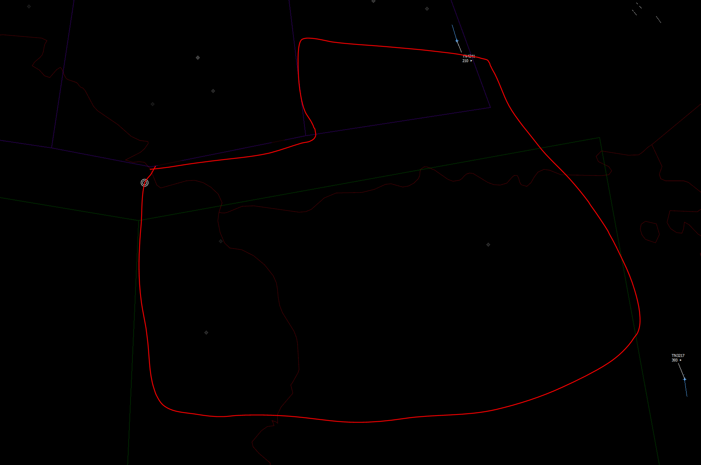

# OBJECTIVE

Support MQT check-out with aggressor flight.

Single engagement, after Panther 1 flight has strike'd objective or as per Panter 1-2 directives.

### RESTRICTIONS

AIM9 AND AIM7 ONLY.
ONE DEATH ONLY

### SAFETY AND KILL (S&K)

FREQUENCY, EXPECT 245.000 (RED 5)  
AGGRESSOR FLIGHT WILL BE PUSHED HERE W/O CHECKIN JUST PRIOR TO COMMIT FOR S&K
POSSIBLY ALSO OTHER FLIGHTS DEPENDING ON THEIR PROXIMITY TO MERGE.  
  
AGGRESSORS FLOW SOUTH ON DEATH.  
BLUE FLOW WEST ON DEATH.  

### CONTROL

AGGRESSORS EXPECT SEPERATE CONTROL FREQ INITALLY, AND VECTORS TO MERGE ON INTERNAL FREQ.  

### INTENDED ENGAGEMENT AREA

