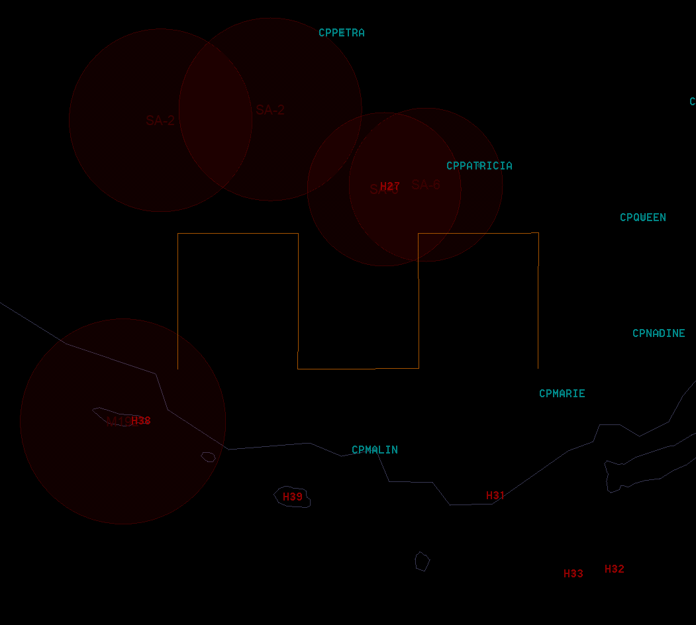

# GAMEPLAN
## MSN#AW3463

### THREAT

TYPE | ALTITUDE | RGN
- | - | -
SA-2 | 82 000 | 25 NM
SA-6 | 26 000  | 19 NM 
MIM-23 | 45 000 | 26 NM
SA-8  | 21 000 | 8 NM
SA-15 | 26 000 | 7 NM
IR VARIOUS | 15 000 | 3 NM

### FLOW

RAVEN 5 FIRST ON STATION TO SWEEP AO.  
PAY SPECIAL ATTENTION AND RELAY UNANNOUCED DIRT.  
  
JEDI 4 ARRIVES IN AO, CAP LOCATION BY MAGIC

### MAGIC INTENT

AGGRESSIVE HIGH-ALT CAP, SHOTS LATEST WHEN ENY A/C LEAVES THEIR SAM WEZ.  
STACKED 2 FLIGHT CAP, CENTRALISED OVER AR/SEAD EFFORTS.  
EXPECT KILL MSN TO 1 FLIGHT SHORTLY FOLLOWED BY SUPPORT MSN TO SECOND FLIGHT  
EXPECT PUMP DIRECTIVE TO CHANGE ENGAGED FLIGHT WHEN/IF ENY SAM WEZ IS FACTOR.  

### CHALLENGES

NEW GROUPS OUT OF H27, WHILST SA-6 FORCING HIGH ALTITUDE TO STAY OUT OF SAM WEZ.
EAST/WEST ATTACKS SEPARATING CAP FLIGHTS.    
