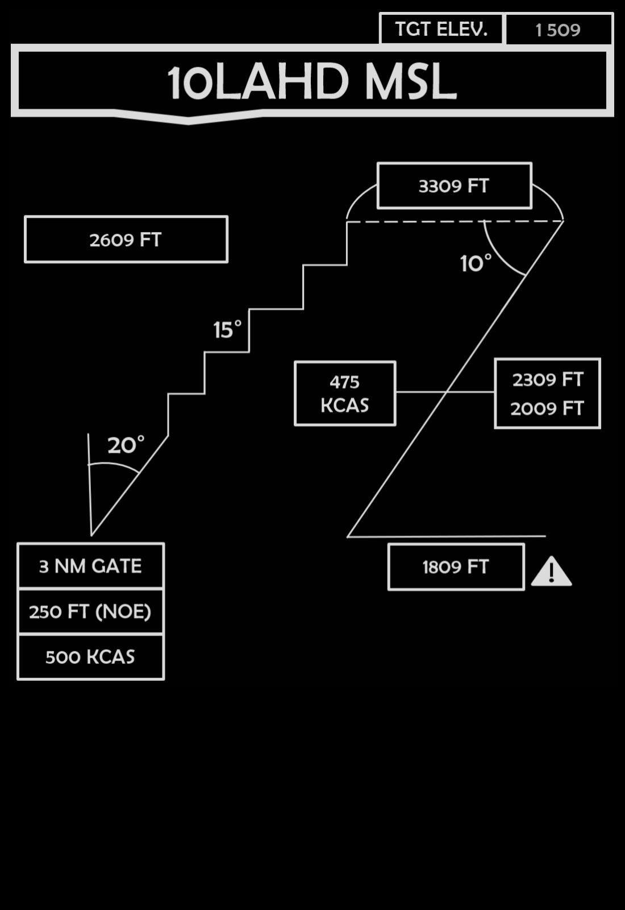
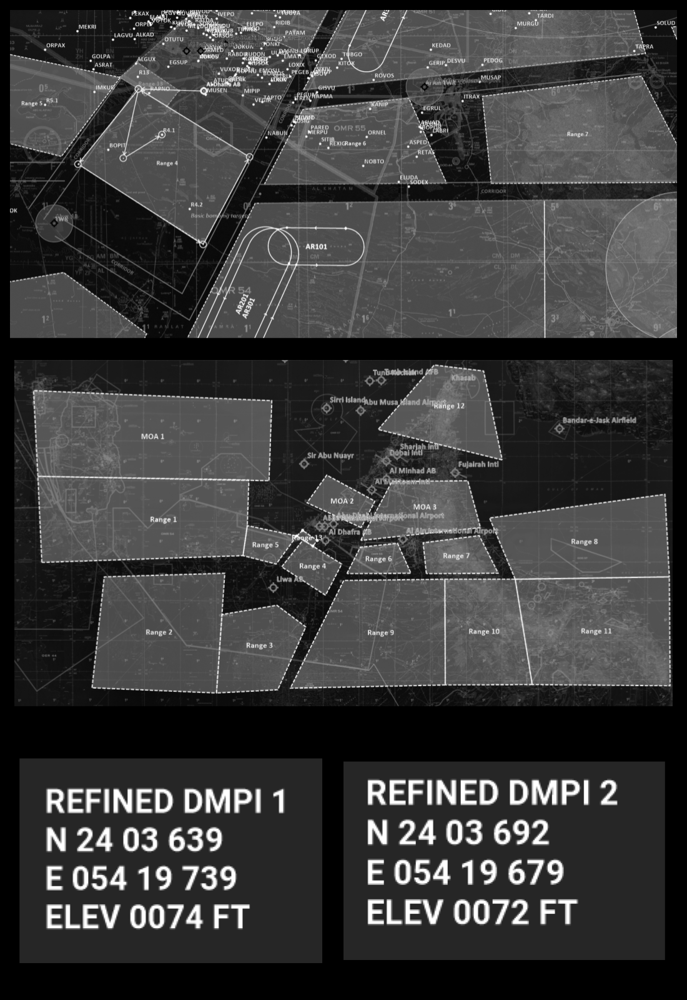
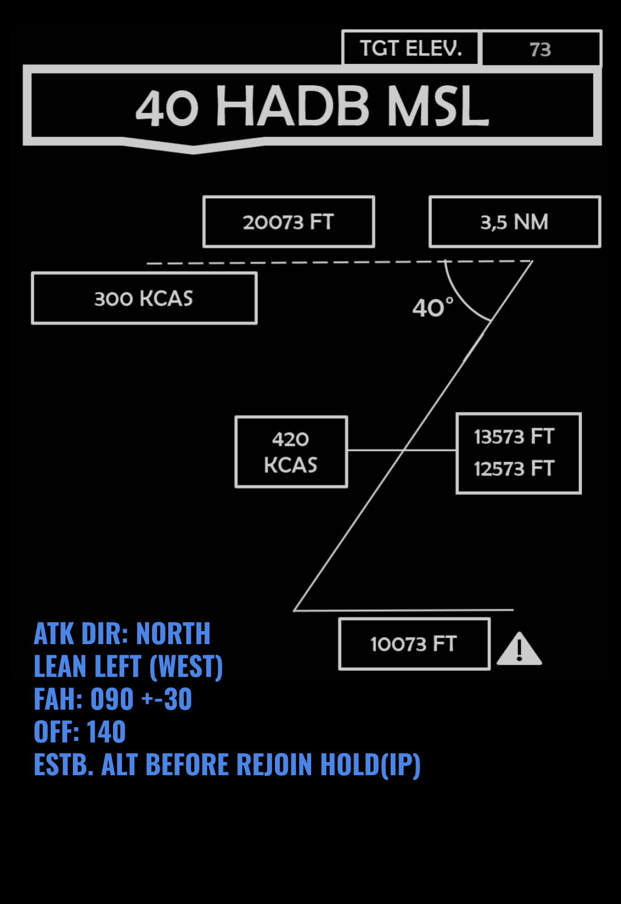
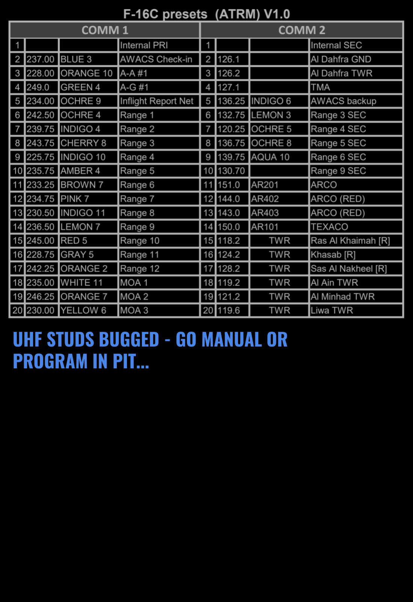
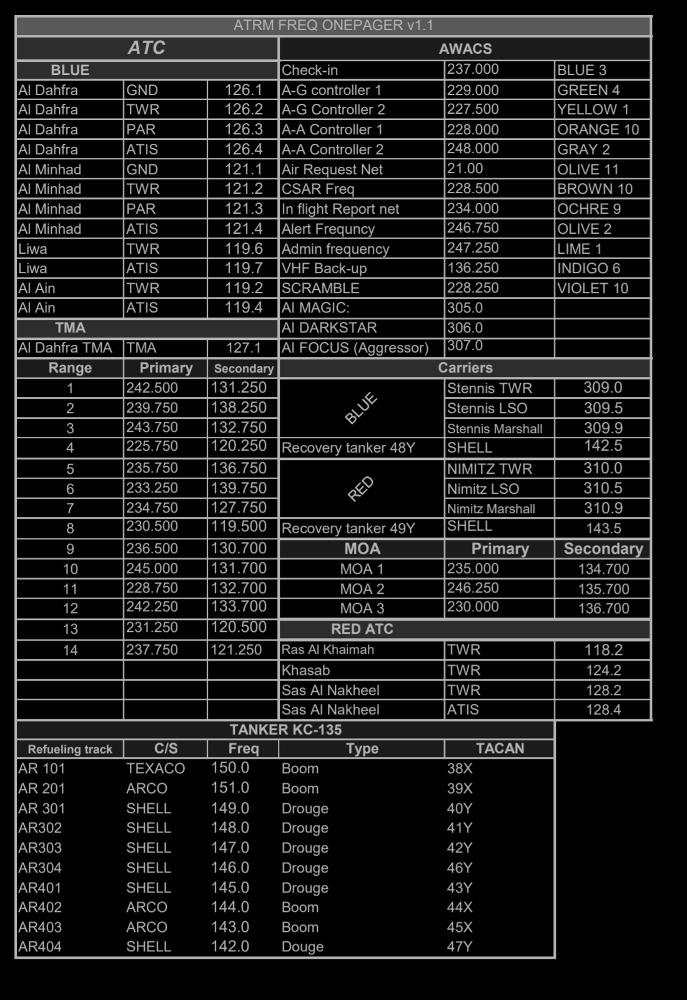

 |  | 
- | - | -
[VIPER START](/F16START.MD) | [FLIP GULF](https://www.dropbox.com/s/sp91zf63rx0esao/FLIP_GULFR2_EC1.pdf?dl=0) | [FLIP CAUCASUS](https://www.dropbox.com/s/ppiqy9ba7i8h8op/FLIP_CAUR_EC1.pdf?dl=0)

## VIPER 1 - TR5041

Flight Lead: DAVID  
WM2: NECK  
EL: ASHILTA  
TACAN:: 62 - 125Y  

## FP
DEP: VFR SOUTH, 350IAS INI.FL120 DIR. RANGE4  
REC: ATC DISCRETION  
--  
LOAD: X6 MK82 LD PER A/C  
				
## Objective
Range practise RGN 4  

## LOADOUT

left | right
----- | -----
S1 - CAP-9M | S9 - AN/ASQ-T50
S2 - - | S8 - -
S3 - 3xMK-82 LD | S7 - 3xMK-82 LD
S4 - TANK 370 | S6 - TANK 370
S5 - - | GUN - SAPHEI
CHAFF - 60 | FLARE - 60

## STEERPOINTS

---  												
###	59	NAOMI	N	26	10,309	  -  	E	056	14,516		GEOREF	
												
---  												
####	00	Al Dhafra AB									0 - 0	
#####  	FUEL:		MAX		WALK:		19:00:00	T/O T:		19:30:00		
												
												
---  												
###	01	R4_NW	N	24	15,946	  -  	E	054	12,864			
#####	DIST:	017,5  NM	BINGO:	9481	ALT:		15.0 M	MACH:	0,7			
#####	HDG:	270°	GS:	444	ETE:		00:02:22	TOT:		19:32:22		
												
												
---  												
###	02	R4_SW	N	23	55,881	  -  	E	053	55,191			
#####	DIST:	025,8  NM	BINGO:	9006	ALT:		15.0 M	MACH:	0,7			
#####	HDG:	217°	GS:	444	ETE:		00:03:29	TOT:		19:35:51		
												
												
---  												
###	03	R4_SE	N	23	34,381	  -  	E	054	31,869			
#####	DIST:	039,9  NM	BINGO:	8272	ALT:		15.0 M	MACH:	0,7			
#####	HDG:	121°	GS:	442	ETE:		00:05:25	TOT:		19:41:16		
												
												
---  												
###	04	R4_NE	N	23	57,829	  -  	E	054	45,412			
#####	DIST:	026,5  NM	BINGO:	7783	ALT:		15.0 M	MACH:	0,7			
#####	HDG:	026°	GS:	442	ETE:		00:03:36	TOT:		19:44:52		
												
												
---  												
###	05	R4_NW2	N	24	15,986	  -  	E	054	12,820			
#####	DIST:	034,9  NM	BINGO:	7141	ALT:		15.0 M	MACH:	0,7			
#####	HDG:	300°	GS:	444	ETE:		00:04:43	TOT:		19:49:35		
												
												
---  												
###	06	IP_R41	N	23	57,478	  -  	E	054	08,434			
#####	DIST:	018,9  NM	BINGO:	6792	ALT:		15.0 M	MACH:	0,7			
#####	HDG:	191°	GS:	443	ETE:		00:02:34	TOT:		19:52:09		
												
												
---  												
###	07	R4.1	N	24	03,796	  -  	E	054	19,729			
#####	DIST:	012,1  NM	BINGO:	2670	ALT:		15.0 M	MACH:	0,7			
#####	HDG:	057°	GS:	440	ETE:		00:01:39	TOT:		19:53:48	VUL:	00:30:00
####	PROG DMPI LEAD #1 TWO #2 THREE #1											

## METAR: 

#### NOTAM: 
REPORT PASSING 3000 FT  

## COMMS

#### FL PRIMARY / - / GRAY6 / 235.250 / AMPN:PROGRAM
#### FL SECONDARY / - / OLIVE4 / 141.750 / AMPN:PROGRAM
#### AL DAHFRA GND / - / LIME2 / 126.100 / AMPN:0
#### AL DAHFRA TWR / - / AL DAHFRA TWR / 126.200 / AMPN:0
#### AL DAHFRA TMA / - / RED4 / 127.100 / AMPN:0
#### CHECK IN / - / BLUE3 / 237.0 / AMPN:0
#### SPARTAN PRI / - / PURPLE11 / 127.750 / AMPN:0
#### SPARTAN SEC / - / PINK7 / 234.750 / AMPN:0
#### ATR IN FLT RPT / - / OCHRE9 / 234.0 / AMPN:0
#### Liwa TWR / - / Liwa TWR / 119.600 / AMPN:DIVERT. RGN 4
#### Liwa ATIS / - / Liwa ATIS / 119.700 / AMPN:0
#### Al Ain TWR / - / Al Ain TWR / 119.200 / AMPN:DIVERT. RGN 7
#### Al Ain ATIS / - / Al Ain ATIS / 119.400 / AMPN:0

## SPINS

### RAMROD

| 0 | 1 | 2 | 3 | 4 | 5 | 6 | 7 | 8 | 9 |
| - | - | - | - | - | - | - | - | - | - |
| L | U | M | B | E | R | J | A | C | K |

## TCN
TACAN:: 62 - 125Y  

  
[FLIP GULF](https://www.dropbox.com/s/sp91zf63rx0esao/FLIP_GULFR2_EC1.pdf?dl=0)
[FLIP CAUCASUS](https://www.dropbox.com/s/ppiqy9ba7i8h8op/FLIP_CAUR_EC1.pdf?dl=0)

