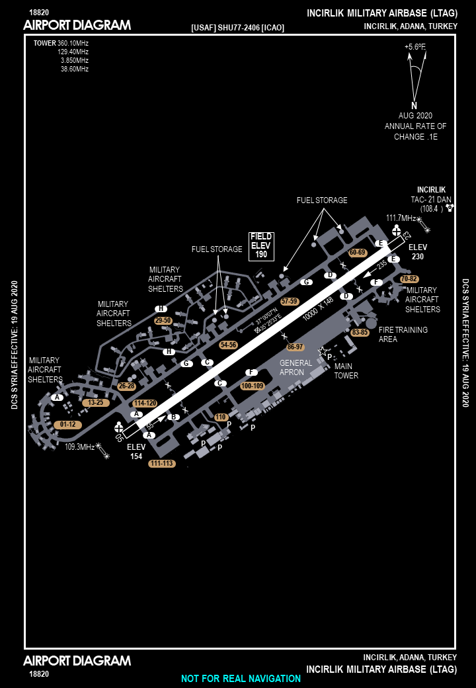
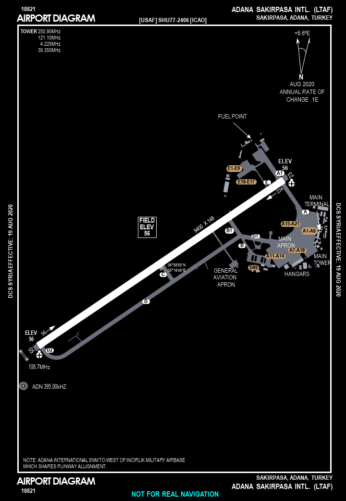

 |  | 
- | - | - | - | -
[MDC PAGES](/MDCPAGES.MD) | [VIPER CHECKLISTS](/F16START.MD) | [VFR PG](/VFR_OMAM.MD) | [FLIP GULF](https://www.dropbox.com/s/sp91zf63rx0esao/FLIP_GULFR2_EC1.pdf?dl=0) | [FLIP CAUCASUS](https://www.dropbox.com/s/ppiqy9ba7i8h8op/FLIP_CAUR_EC1.pdf?dl=0)
- | - 
[KNEEPACK](/VIPER/388KNEE11.pdf) | [EMERGENCY](/VIPER/EMERG191221.pdf)

## GND

### MDC DOC
[MDC](http://mdc.hatchlane.com/templates/StandardDark/template.htm?kb=98qkK0fI)

 |  | 
- | - | - | - | -
[MDC PAGES](/MDCPAGES.MD) | [VIPER CHECKLISTS](/F16START.MD) | [VFR PG](/VFR_OMAM.MD) | [FLIP GULF](https://www.dropbox.com/s/sp91zf63rx0esao/FLIP_GULFR2_EC1.pdf?dl=0) | [FLIP CAUCASUS](https://www.dropbox.com/s/ppiqy9ba7i8h8op/FLIP_CAUR_EC1.pdf?dl=0)
- | - 
[KNEEPACK](/VIPER/388KNEE11.pdf) | [EMERGENCY](/VIPER/EMERG191221.pdf)

