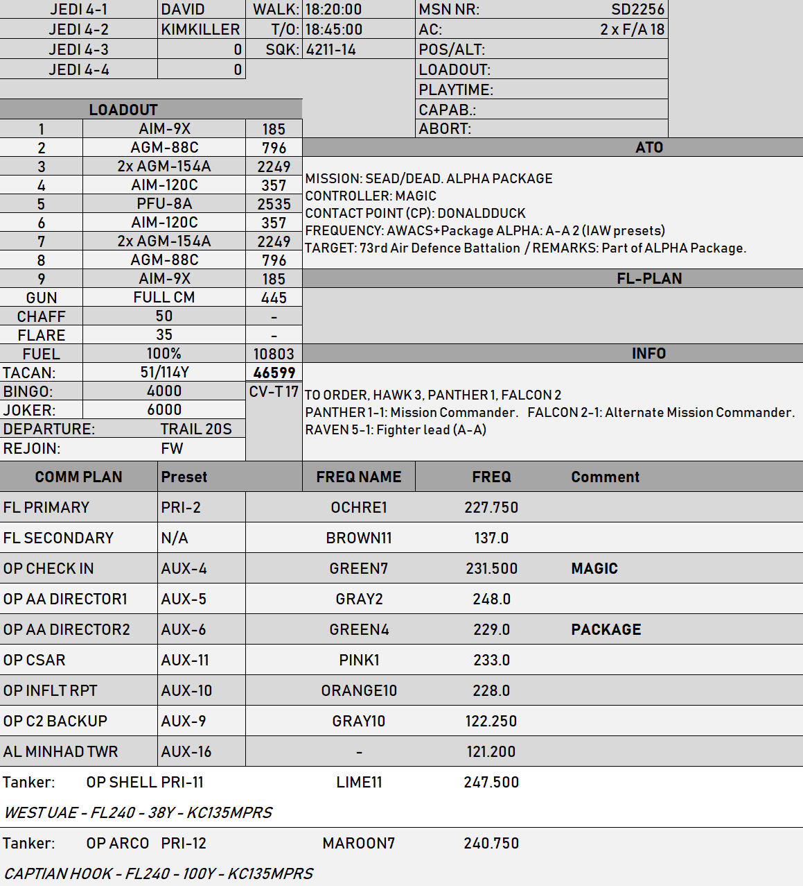
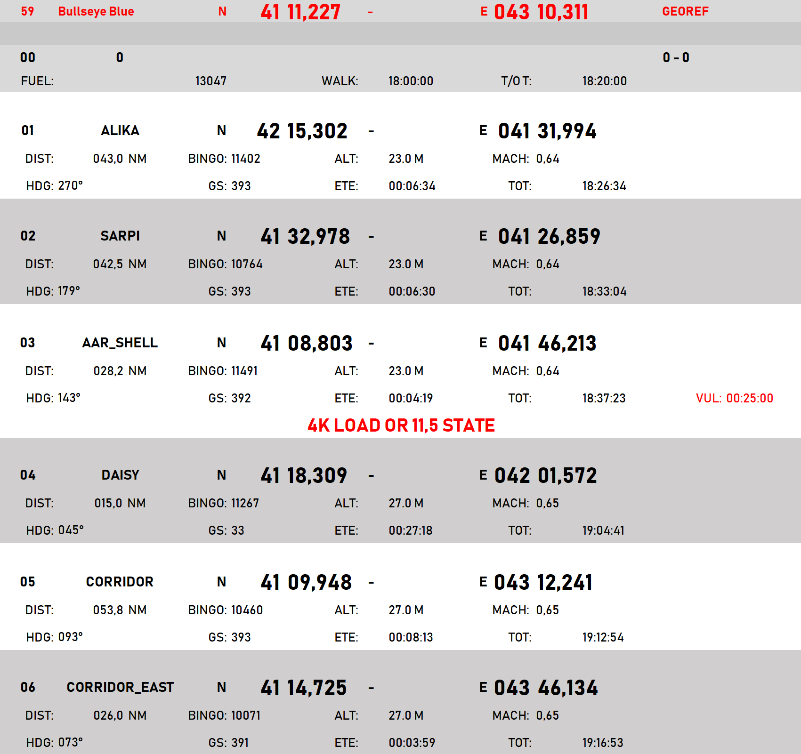
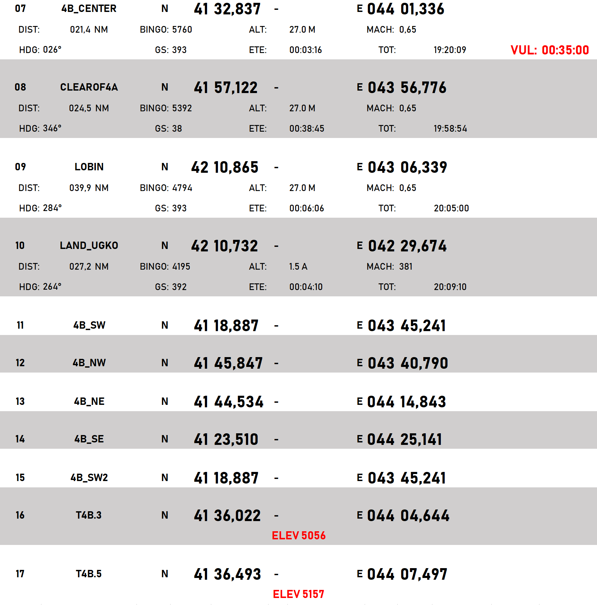
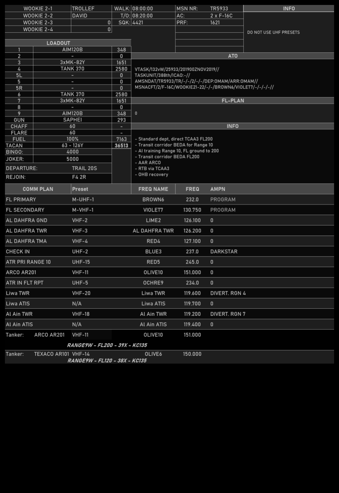

 |  | 
- | - | -
[CV-OPs](/CVOPS/cvops.md) | [FLIP GULF](https://www.dropbox.com/s/sp91zf63rx0esao/FLIP_GULFR2_EC1.pdf?dl=0) | [FLIP CAUCASUS](https://www.dropbox.com/s/ppiqy9ba7i8h8op/FLIP_CAUR_EC1.pdf?dl=0)

## JEDI 4 - TR3101

Flight Lead: DAVID  
WM2: JAEGER  
Element Lead:   
WM4:   
TACAN: 53 - 116Y  

## FLIGHTPLAN
0

## LOADOUT

left | right
----- | -----
S1 - AIM-9X | S9 - AIM-9X
S2 - GBU-38 | S8 - GBU-38
S3 - 2x GBU-12 | S7 - PFU-8A
S4 - AIM7MH | S6 - AIM7MH
S5 - AN/AAQ-28 | GUN - FULL CM
CHAFF - 50 | FLARE - 35
FUEL - 1 | WEIGHT: 43919

## STEERPOINTS
###	03	3	N	41	16,892	  -  	E	042	50,206			
#####	DIST:	004,6  NM	BINGO:	10654	ALT:		27.0 M	MACH:	0,64			
#####	HDG:	001°	GS:	388	ETE:		00:00:43	TOT:		12:34:26		
												
												
---  												
###	04	4	N	41	43,013	  -  	E	042	55,423			
#####	DIST:	026,4  NM	BINGO:	10258	ALT:		27.0 M	MACH:	0,64			
#####	HDG:	002°	GS:	387	ETE:		00:04:06	TOT:		12:38:32		
												
												
---  												
###	05	5	N	41	45,738	  -  	E	043	40,881			
#####	DIST:	034,1  NM	BINGO:	9748	ALT:		27.0 M	MACH:	0,64			
#####	HDG:	079°	GS:	385	ETE:		00:05:18	TOT:		12:43:50		
												
												
---  												
###	06	SAGHAMO LAKE	N	41	18,340	  -  	E	043	44,545			
#####	DIST:	027,6  NM	BINGO:	9335	ALT:		27.0 M	MACH:	0,64			
#####	HDG:	168°	GS:	386	ETE:		00:04:17	TOT:		12:48:07		
												
												
---  												
###	07	BLUE_BULLS	N	41	11,188	  -  	E	043	10,380			
#####	DIST:	026,7  NM	BINGO:	8935	ALT:		27.0 M	MACH:	0,64			
#####	HDG:	249°	GS:	387	ETE:		00:04:08	TOT:		12:52:15		
												
												
---  												
###	08	8	N	41	12,241	  -  	E	042	49,461			
#####	DIST:	015,8  NM	BINGO:	8698	ALT:		27.0 M	MACH:	0,64			
#####	HDG:	268°	GS:	384	ETE:		00:02:28	TOT:		12:54:43		
												
												
---  												
###	09	MOUSE	N	41	20,669	  -  	E	041	41,232			
#####	DIST:	052,0  NM	BINGO:	7919	ALT:		27.0 M	MACH:	0,64			
#####	HDG:	274°	GS:	387	ETE:		00:08:04	TOT:		13:02:47		
												
												
---  												
###	10	Kutaisi	N	42	10,733	  -  	E	042	29,733			
#####	DIST:	061,8  NM	BINGO:	6557	ALT:		1.5 A	MACH:	0,64			
#####	HDG:	029°	GS:	425	ETE:		00:08:44	TOT:		13:11:31		
												

## METAR: 

#### NOTAM: 

## COMMS

## SPINS

### RAMROD

| 0 | 1 | 2 | 3 | 4 | 5 | 6 | 7 | 8 | 9 |
| - | - | - | - | - | - | - | - | - | - |
| B | L | A | C | K | H | O | R | S | E |

### BASE

| ALTITUDE | SPEED | HEADING | NUMBER| 
| -------- | ----- | ------- | ----- | 
| 5000ft AMSL | 300 Kts | 300 degrees | 5 |

### CODEWORDS

| MEANING | CODEWORD | 
| ------- | -------- | 
| ON STATION | ALABAMA | 
| OFF STATION | BABYLON |
| RTB | CHICAGO |
| MISSION CANCEL | DENVER |
| MISSION SUCCESSFUL| ERIE |
| MISSION UNSUCCESSFUL| FRANKFURT |
| ATTACK SUCCESSFUL | GEORGIA |
| ATTACK UNSUCCESSFUL | HIGHLAND |
| LAST OFF TARGET| ILLINOIS |
| REATTACK | JAKARTA |
| PUSHING | KENTUCKY |
| ROLEX | LOUSVILLE |
| REQUEST ROLEX| MEMPHIS|
| WOUNDED BIRD | NANTUCKET |
| FEET WET | OHIO |
| FEET DRY | PHILIPPINES |

## TCN

## ROE:

## Intel:

## TASK

  
[FLIP GULF](https://www.dropbox.com/s/sp91zf63rx0esao/FLIP_GULFR2_EC1.pdf?dl=0)
[FLIP CAUCASUS](https://www.dropbox.com/s/ppiqy9ba7i8h8op/FLIP_CAUR_EC1.pdf?dl=0)

