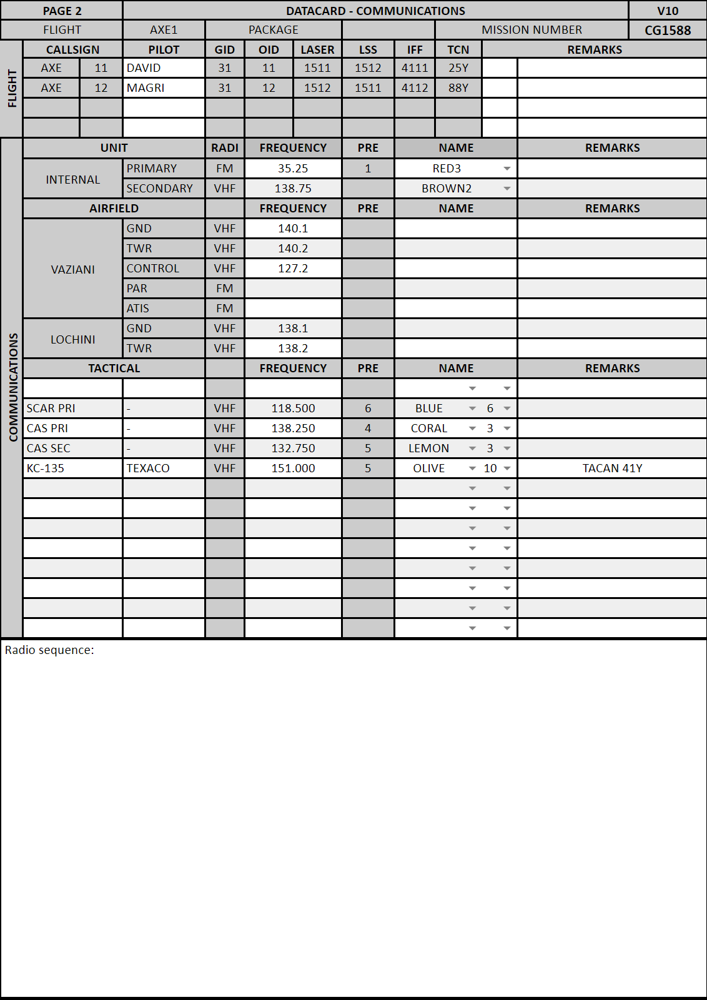

 |  | 
- | - | -
[VIPER START](/F16START.MD) | [FLIP GULF](https://www.dropbox.com/s/sp91zf63rx0esao/FLIP_GULFR2_EC1.pdf?dl=0) | [FLIP CAUCASUS](https://www.dropbox.com/s/ppiqy9ba7i8h8op/FLIP_CAUR_EC1.pdf?dl=0)

## NAME - MSN# - TIMEDATE

FL: 

WM: 

EL: 

EW: 

## FP

				

## Objective
#### LAHD RANGE 12
[RGN12 TARGET](/ATRM/ATRM_VIPER1_RANGE12_ME_STATIC.pdf)

## LOADOUT

left | right
----- | -----
S1 - AIM120C | S9 - AIM120C
S2 - AN/ASQ-T50 | S8 - AIM-9X
S3 - 2xMK-82Y | S7 - 2xMK-82Y
S4 - TANK 370 | S6 - TANK 370
S5L - - | S5R - -
S5 - - | SGUN - SAPHEI
CHAFF - 60 | FLARE - 60

## STEERPOINTS

---  												
###	59	BULLSEYE JENNY	N	23	57,739	  -  	E	055	48,227		GEOREF	
												
---  												
####	00	Al Dhafra AB									0 - 0	
#####  	FUEL:		12103		WALK:		08:00:00	T/O T:		08:30:00		
												
												
---  												
###	01	TCAA4	N	24	11,124	  -  	E	054	56,615			
#####	DIST:	022,8  NM	BINGO:	11183	ALT:		15.0 M	MACH:	0,7			
#####	HDG:	099°	GS:	444	ETE:		00:03:05	TOT:		08:33:05		
												
												
---  												
###	02	TCAA5	N	25	01,868	  -  	E	055	25,587			
#####	DIST:	057,2  NM	BINGO:	10129	ALT:		15.0 M	MACH:	0,7			
#####	HDG:	026°	GS:	443	ETE:		00:07:45	TOT:		08:40:50		
												
												
---  												
###	03	R12_SE	N	25	15,864	  -  	E	056	59,498			
												
---  												
###	04	R12_NE	N	26	21,924	  -  	E	056	43,845			
											
---  												
###	05	R12_NW	N	26	26,377	  -  	E	056	02,963			
											
---  												
###	06	R12_SW	N	25	38,810	  -  	E	055	15,728														
												
---  												
###	07	RGN_ENTRY	N	25	27,179	  -  	E	056	07,935			
#####	DIST:	048,5  NM	BINGO:	9236	ALT:		15.0 M	MACH:	0,7			
#####	HDG:	102°	GS:	442	ETE:		00:06:35	TOT:		09:21:55		
												
												
---  												
###	08	INGRESS	N	25	46,203	  -  	E	056	21,148			
#####	DIST:	022,5  NM	BINGO:	8741	ALT:		0.2 M	MACH:	0,8			
#####	HDG:	030°	GS:	536	ETE:		00:02:31	TOT:		09:24:26		
												
												
---  												
###	09	LEFT	N	26	04,995	  -  	E	056	28,387			
#####	DIST:	019,9  NM	BINGO:	8302	ALT:		0.2 M	MACH:	0,8			
#####	HDG:	017°	GS:	531	ETE:		00:02:15	TOT:		09:26:41		
												
												
---  												
###	10	IP	N	26	15,041	  -  	E	056	14,387			
#####	DIST:	016,1  NM	BINGO:	7948	ALT:		0.2 M	MACH:	0,76			
#####	HDG:	307°	GS:	508	ETE:		00:01:54	TOT:		09:28:35		
												
												
---  												
###	11	RGN12_TGT_ELEV_0174	N	26	22,347	  -  	E	056	21,242			
#####	DIST:	009,6  NM	BINGO:	7737	ALT:		0.2 M	MACH:	0,76			
#####	HDG:	038°	GS:	506	ETE:		00:01:08	TOT:		09:29:43		
												
												
---  												
###	12	OFF	N	26	14,186	  -  	E	056	29,737			
#####	DIST:	011,2  NM	BINGO:	7491	ALT:		0.2 M	MACH:	0,8			
#####	HDG:	135°	GS:	529	ETE:		00:01:16	TOT:		09:30:59		
												
												
---  												
###	13	EGRESS	N	25	52,022	  -  	E	056	13,378			
#####	DIST:	026,6  NM	BINGO:	6905	ALT:		0.2 M	MACH:	0,8			
#####	HDG:	212°	GS:	535	ETE:		00:02:59	TOT:		09:33:58		
												
												
---  												
###	14	Al Dhafra AB	N	24	15,433	  -  	E	054	32,050			
#####	DIST:	133,3  NM	BINGO:	4450	ALT:		15.0 M	MACH:				
#####	HDG:		GS:	499	ETE:		00:16:02	TOT:		09:50:00		
												

## METAR: 

#### NOTAM: 

## COMMS

#### FL PRIMARY / - / GRAY6 / 235.250 / AMPN:PROGRAM
#### FL SECONDARY / - / OLIVE4 / 141.750 / AMPN:PROGRAM
#### AL DAHFRA GND / - / LIME2 / 126.100 / AMPN:0
#### AL DAHFRA TWR / - / AL DAHFRA TWR / 126.200 / AMPN:0
#### AL DAHFRA TMA / - / RED4 / 127.100 / AMPN:0
#### CHECK IN / - / BLUE3 / 237.0 / AMPN:DARKSTAR
#### ATR PRI RANGE 12 / - / ORANGE2 / 242.250 / AMPN:0
#### ARCO AR201 / - / OLIVE10 / 151.000 / AMPN:0
#### ATR IN FLT RPT / - / OCHRE9 / 234.0 / AMPN:0
#### Liwa TWR / - / Liwa TWR / 119.600 / AMPN:DIVERT. RGN 4
#### Liwa ATIS / - / Liwa ATIS / 119.700 / AMPN:0
#### Al Ain TWR / - / Al Ain TWR / 119.200 / AMPN:DIVERT. RGN 7
#### Al Ain ATIS / - / Al Ain ATIS / 119.400 / AMPN:0

## SPINS

### RAMROD

| 0 | 1 | 2 | 3 | 4 | 5 | 6 | 7 | 8 | 9 |
| - | - | - | - | - | - | - | - | - | - |
| C | O | M | P | L | E | X | I | T | Y |

### BASE

### CODEWORDS

## TCN
62 - 125Y  

## ROE:

## Intel:

## TASK

  
[FLIP GULF](https://www.dropbox.com/s/sp91zf63rx0esao/FLIP_GULFR2_EC1.pdf?dl=0)
[FLIP CAUCASUS](https://www.dropbox.com/s/ppiqy9ba7i8h8op/FLIP_CAUR_EC1.pdf?dl=0)

