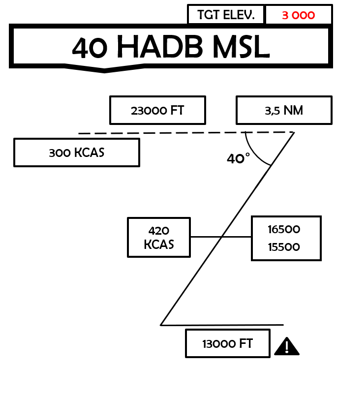
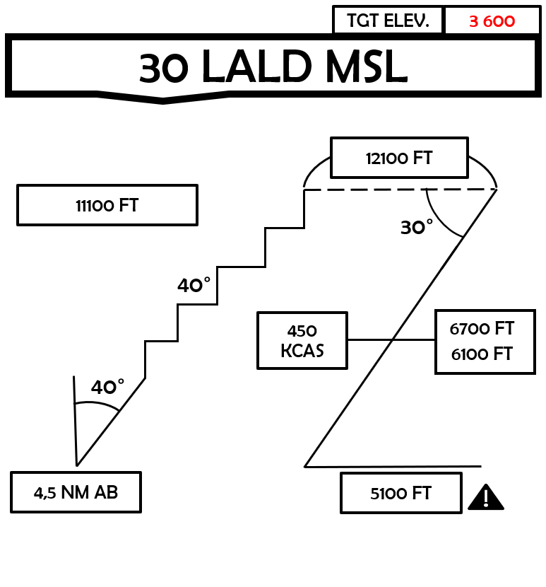
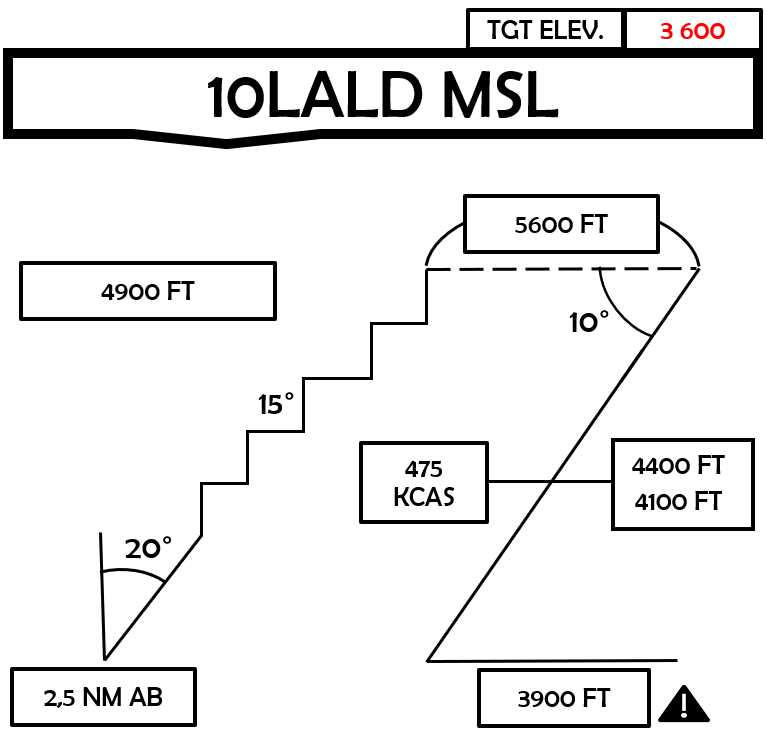

 |  | 
- | - | -
[CV-OPs](/CVOPS/cvops.md) | [FLIP GULF](https://www.dropbox.com/s/sp91zf63rx0esao/FLIP_GULFR2_EC1.pdf?dl=0) | [FLIP CAUCASUS](https://www.dropbox.com/s/ppiqy9ba7i8h8op/FLIP_CAUR_EC1.pdf?dl=0)

## JEDI 4 - TR3190

Flight Lead: DAVID  
WM2: ASHILTA  
Element Lead:   
WM4:   
TACAN:: 53 - 116Y  

## FLIGHTPLAN
"2X F/A18C, VFR-EAST T/O 1825Z - LOBIN -> R3B
AAR-SHELL - R3B -> LOBIN
RECOVER FROM EAST."

## LOADOUT

left | right
----- | -----
S1 - CAP-9M | S9 - AN/ASQ-T50
S2 - - | S8 - -
S3 - 2xMK-82 LD | S7 - 2xMK-82 LD
S4 - - | S6 - -
S5 - - | GUN - FULL CM
CHAFF - 50 | FLARE - 35
FUEL - 1 | WEIGHT: 39693

## OBJECTIVE

Objctive 1: Know the different strategic and counterland mission-types:
(Strike, AI, GAI, SCAR, CAS, FAC(A), CSAR).

Objective 2: Use correct FENCE as per SOP.

Objective 3: Know and respect Targeting Contract: 
(At no given time must both pilots be heads-down, unless deconflicted and in permissive environment).

Objective 4: Able to give and receive 3-point attack brief.

Objective 5: Know the difference between shooter-shooter and shooter-cover and when they can be used.

Objective 6: Know how to set up a wheel .

Objective 7: Understand the advantages and disadvantages of a popup-attack and be able to execute it.

Objective 8: Able to set up and execute a level, low level attack using retarded bombs.

### Lesson content
This lesson is a special form of self-qualification.
The lesson must be flown with another MQ pilot (MQ or above). MQ pilot will be Flight lead for trainee.
Once all objctives are met, you must self-qualify this lesson.

This flight should be divided in two parts:
Part 1: Low threat.
Focus is to conduct basic A-G tactics in a permissive environment: Recive 3-point attack brief, orbit in a wheel, simple talk-on. This first part is to prepare the trainee to conduct CAS and AR missions with a more dynamic flow.

Part 2: High threat.
The second part focuses on pre-planned attacks in a high threat environment to prepare for Strike, OCA attack and AI missions. The flight need to ingress low level to a IP, continue into the target to conduct coordinated attacks shooter-shooter.

## STEERPOINTS

## WINGMAN

## LEAD

## METAR: 

#### NOTAM: 

## COMMS

## SPINS

### RAMROD

## COMPLEXITY

  
[FLIP GULF](https://www.dropbox.com/s/sp91zf63rx0esao/FLIP_GULFR2_EC1.pdf?dl=0)
[FLIP CAUCASUS](https://www.dropbox.com/s/ppiqy9ba7i8h8op/FLIP_CAUR_EC1.pdf?dl=0)

