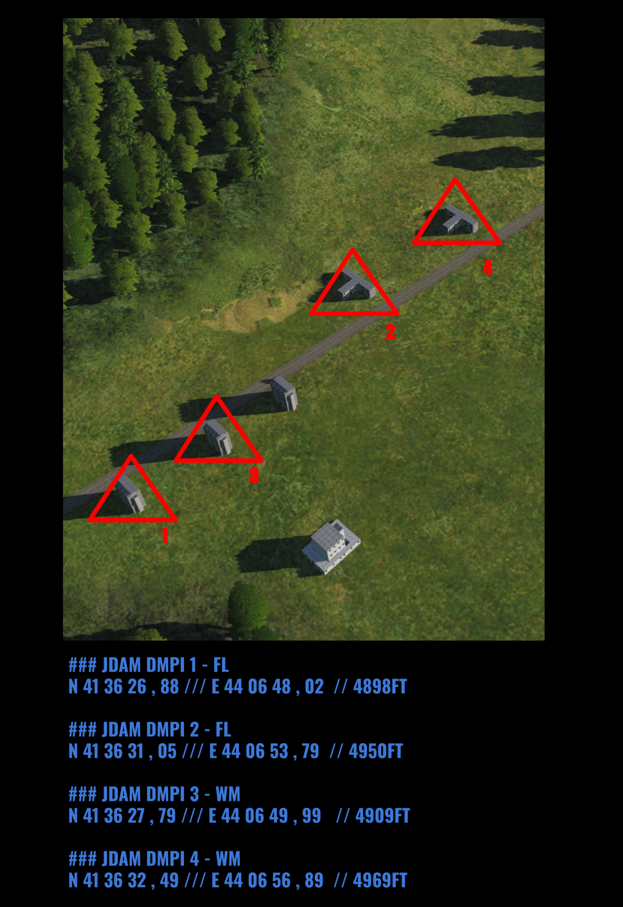
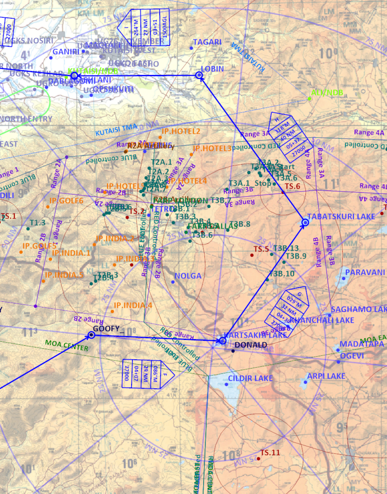

 |  | 
- | - | -
####  [CV-OPs](/CVOPS/cvops.md) | [FLIP GULF](https://www.dropbox.com/s/sp91zf63rx0esao/FLIP_GULFR2_EC1.pdf?dl=0) | [FLIP CAUCASUS](https://www.dropbox.com/s/ppiqy9ba7i8h8op/FLIP_CAUR_EC1.pdf?dl=0)

## RAVEN51 - MSN#TR2658 - JULY 7TH

FL: DAVID

## FP

				

## Objective
#### 

## LOADOUT

## STEERPOINTS
---  											
###	59	BULLSEYE BLUE		N 41	11,227	  -  	E 43	10,311		BULLSEYE	
											
---  											
####	00	KUT_TO								52 - 0	
#####  	FUEL:		15291		WALK:	18:25:00	T/O T:		18:55:00		
											
											
---  											
###	01	ALIKA1		N 42	15,219	  -  	E 41	31,968			
#####	DIST:	043,0  NM	BINGO:	F 12506	ALT:	27000 - 270					
#####	HDG:	276°	GS:	422	ETE:	00:06:07	TOT:		19:11:07	VUL:	00:10:00
											
											
---  											
###	02	SARPI1		N 41	32,978	  -  	E 41	26,859			
#####	DIST:	042,4  NM	BINGO:	F 11870	ALT:	27000 - 270					
#####	HDG:	185°	GS:	450	ETE:	00:05:40	TOT:		19:16:47		
											
											
---  											
###	03	MOUSE1		N 41	20,669	  -  	E 41	41,232			
#####	DIST:	016,4  NM	BINGO:	F 11624	ALT:	27000 - 270					
#####	HDG:	139°	GS:	450	ETE:	00:02:11	TOT:		19:18:58		
											
											
---  											
###	04	GOOFY_1		N 41	14,125	  -  	E 42	34,618			
#####	DIST:	040,7  NM	BINGO:	F 11015	ALT:	27000 - 270					
#####	HDG:	099°	GS:	450	ETE:	00:05:25	TOT:		19:24:23		
											
											
---  											
###	05	DONALD1		N 41	10,509	  -  	E 43	16,290			
#####	DIST:	031,6  NM	BINGO:	F 10541	ALT:	27000 - 270					
#####	HDG:	096°	GS:	450	ETE:	00:04:13	TOT:		19:28:36		
											
											
---  											
###	06	MADATAPA LAKE1		N 41	10,706	  -  	E 43	47,028			
#####	DIST:	023,2  NM	BINGO:	F 09054	ALT:	27000 - 270					
#####	HDG:	089°	GS:	450	ETE:	00:03:05	TOT:		19:31:41	VUL:	00:10:00
											
											
---  											
###	07	IP1		N 41	27,791	  -  	E 44	03,495			
#####	DIST:	021,1  NM	BINGO:	F 08738	ALT:	27000 - 270					
#####	HDG:	036°	GS:	500	ETE:	00:02:32	TOT:		19:44:13		
											
											
---  											
###	08	T4B.51		N 41	36,493	  -  	E 44	07,497			
#####	DIST:	009,2  NM	BINGO:	F 08030	ALT:	27000 - 270					
#####	HDG:	019°	GS:	500	ETE:	00:01:06	TOT:		19:45:19	VUL:	00:05:00
####	TGT										
											
---  											
###	09	PARAVANI LAKE1		N 41	26,444	  -  	E 43	48,695			
#####	DIST:	017,3  NM	BINGO:	F 07770	ALT:	27000 - 270					
#####	HDG:	235°	GS:	450	ETE:	00:02:18	TOT:		19:52:38		
											
											
---  											
###	10	MADATAPA LAKE21		N 41	10,706	  -  	E 43	47,028			
#####	DIST:	015,8  NM	BINGO:	F 07534	ALT:	27000 - 270					
#####	HDG:	185°	GS:	450	ETE:	00:02:06	TOT:		19:54:44		
											
											
---  											
###	11	MOUSE2		N 41	20,669	  -  	E 41	41,232			
#####	DIST:	095,1  NM	BINGO:	F 06107	ALT:	27000 - 270					
#####	HDG:	277°	GS:	450	ETE:	00:12:41	TOT:		20:07:25		
											
											
---  											
###	12	MICKEY1		N 41	44,866	  -  	E 41	47,985			
#####	DIST:	024,7  NM	BINGO:	F 05736	ALT:	27000 - 270					
#####	HDG:	012°	GS:	450	ETE:	00:03:18	TOT:		20:10:43		
											
											
---  											
###	13	KUT_LAND		N 42	10,733	  -  	E 42	29,733			
#####	DIST:	040,4  NM	BINGO:	F 05130	ALT:	27000 - 270					
#####	HDG:	050°	GS:	450	ETE:	00:05:23	TOT:		20:16:06		
											

## METAR: 

#### NOTAM: 
Looney 7. Jul 2019 15:58  
Will control tonight. Twr and gnd merged on 134.200. I'll check if I can do awacs if needed.  

## COMMS
#### FL PRIMARY / PRI-5 / OCHRE1 / 227.750 / AMPL:
#### FL SECONDARY / N/A / PINK5 / 125.750 / AMPL:
#### CHECK IN / AUX-4 / BLUE3 / 237.0 / AMPL:EXPECTED THRUOUT
#### RANGE 4B PRI / PRI-18 - AUX-18 / PINK7 / 234.750 / AMPL:
#### RANGE 4B SEC / N/A / PURPLE11 / 127.750 / AMPL:
#### C2 BACKUP / N/A / INDIGO6 / 136.250 / AMPL:

## SPINS

## TCN

## ROE:

## Intel:

## TASK

