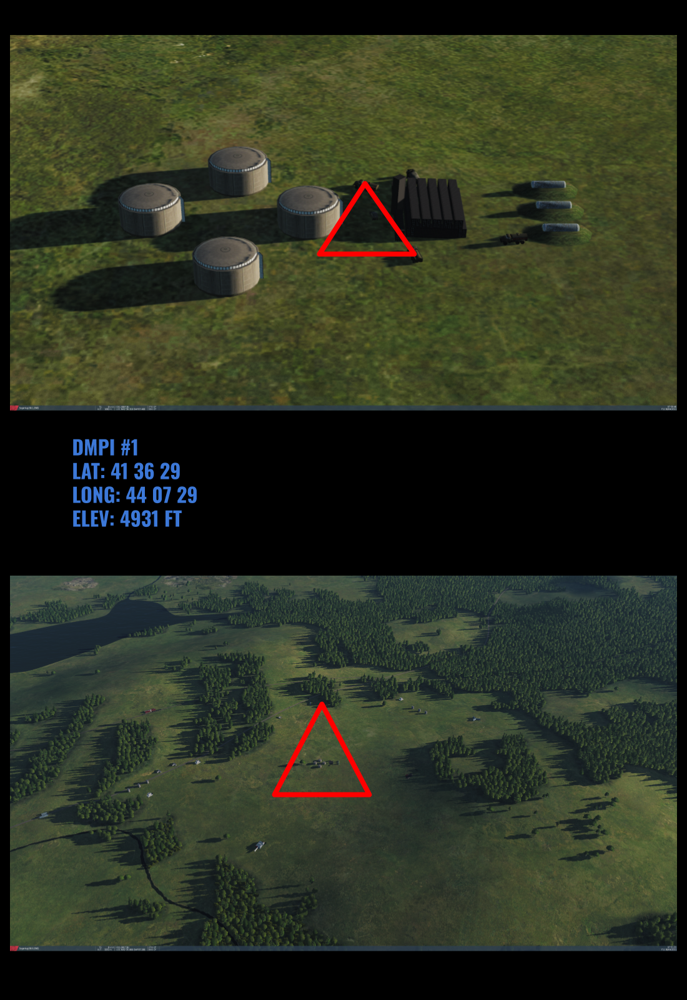

 |  | 
- | - | -
[VIPER START](/F16START.MD) | [FLIP GULF](https://www.dropbox.com/s/sp91zf63rx0esao/FLIP_GULFR2_EC1.pdf?dl=0) | [FLIP CAUCASUS](https://www.dropbox.com/s/ppiqy9ba7i8h8op/FLIP_CAUR_EC1.pdf?dl=0)

## OBJECTIVE  
SUPPORT ASSAFB WITH XCAS OR AS REQUESTED (RETASK)  
T/O AT 1930Z ROUTE TKR ARCO 201 IN RANGE 9, THEN HOLD BETWEEN STEER FOUR AND FIVE  
ROUTING PLANNED IN TRANSIT CORRIDORS DO NOT STRAY  
MONITOR BLUE 3 FOR TASKING ASAP  
USE ADDITIONAL STEERPOINTS FOR CAS  
PROGRAM ECHO WHEN GIVEN TWICE AND USE SECOND ECHO FOR TGP SLEW  

## VIPER 1 - TR6444

---

Flight Lead: DAVID  
WM2: TROLLEF  

TACAN: 62 - 125Y  
SQK: 4411  
PRF: 1611  
  
BINGO: 3500  
JOKER: 5000  
DEPARTURE: TRAIL 20S  
REJOIN: F4 2R  

---
## FLIGHTPLAN
"20SEC DEP, VFR EAST FL190, TC AFRA SOUTH
RECOVERY UNK."

---
## LOADOUT

left | right
----- | -----
S1 - AIM120C | S9 - AIM120C
S2 - - | S8 - AN/ASQ-T50
S3 - 2xGBU-12 | S7 - 19xMK5 HEAT
S4 - TANK 370 | S6 - TANK 370
S5L - - | S5R - AN/AAQ-28
S5 - - | SGUN - AP
CHAFF - 60 | FLARE - 60

---

## COMMS

#### FL PRIMARY / M-UHF-1 / GRAY6 / 235.250 / AMPN:PROGRAM
#### FL SECONDARY / M-VHF-1 / OLIVE4 / 141.750 / AMPN:PROGRAM
#### AL DAHFRA GND / VHF-2 / LIME2 / 126.100 / AMPN:0
#### AL DAHFRA TWR / VHF-3 / AL DAHFRA TWR / 126.200 / AMPN:0
#### AL DAHFRA TMA / VHF-4 / RED4 / 127.100 / AMPN:0
#### CHECK IN / UHF-2 / BLUE3 / 237.0 / AMPN:PROG. DARKSTAR
#### ARCO AR201 / VHF-11 / OLIVE10 / 151.000 / AMPN:0
#### ARCO AR203 / N/A / MAROON11 / 140.0 / AMPN:0
#### ATR IN FLT RPT / UHF-5 / OCHRE9 / 234.0 / AMPN:0
#### AL MINHAD TWR / VHF-19 / AL MINHAD TWR / 121.200 / AMPN:0
#### AL MINHAD ATIS / N/A / AL MINHAD ATIS / 121.400 / AMPN:0
#### Al Ain TWR / VHF-18 / Al Ain TWR / 119.200 / AMPN:PRIMARY DIVERT
#### Al Ain ATIS / N/A / Al Ain ATIS / 119.400 / AMPN:0
#### Tanker: / VHF-11 / OLIVE10 / 151.000 / AMPN:
#### Tanker: / N/A / MAROON11 / 140.0 / AMPN:

---

## STEERPOINTS
---  												
###	BE	BULLSEYE MARY	N	25	16,863	  -  	E	055	52,960		GEOREF	
												
---  												
												
---  												
###	01	Al Dhafra AB	N	24	15,433	  -  	E	054	32,050			
#####	FUEL:	12103	BINGO:	11603	ALT:		52	MACH:	0			
#####					WALK:		19:00:00	T/OT:		19:30:00	VUL:	00:30:00
												
												
---  												
###	02	TCAA4	N	24	11,124	  -  	E	054	56,615			
#####	DIST:	022,8  NM	BINGO:	11375	ALT:		19.0 M	MACH:	0,7			
#####	HDG:	099°	GS:	437	ETE:		00:03:08	TOT:		19:33:08		
												
												
---  												
###	03	TCAA3	N	23	47,903	  -  	E	054	43,480			
#####	DIST:	026,2  NM	BINGO:	12113	ALT:		19.0 M	MACH:	0,7			
#####	HDG:	206°	GS:	436	ETE:		00:03:36	TOT:		19:36:44		
> AMPN: AAR ARCO 201											
												
---  												
###	04	TCBA2	N	23	48,585	  -  	E	055	49,126			
#####	DIST:	060,1  NM	BINGO:	4762	ALT:		19.0 M	MACH:	0,7			
#####	HDG:	088°	GS:	436	ETE:		00:08:16	TOT:		19:45:00	VUL:	01:30:00
												
												
---  												
###	05	TCCA2	N	24	15,556	  -  	E	055	36,260			
#####	DIST:	029,4  NM	BINGO:	4468	ALT:		19.0 A	MACH:	0,7			
#####	HDG:	335°	GS:	19	ETE:		01:34:04	TOT:		21:19:04		
												
												
---  												
###	06	Al Dhafra AB	N	24	15,433	  -  	E	054	32,050			
#####	DIST:	058,6  NM	BINGO:	3648	ALT:		0.1 A	MACH:	0,7			
#####	HDG:	268°	GS:	467	ETE:		00:07:32	TOT:		21:26:36		
												

### MDC DOC
[MDC](/XXX.pdf)

## METAR: 

#### NOTAM: 

## SPINS

### RAMROD

| 0 | 1 | 2 | 3 | 4 | 5 | 6 | 7 | 8 | 9 |
| - | - | - | - | - | - | - | - | - | - |
| C | O | M | P | L | E | X | I | T | Y |

### BASE

| ALTITUDE | SPEED | HEADING | NUMBER| 
| -------- | ----- | ------- | ----- | 
| 5000ft AMSL | 300 Kts | 300 degrees | 5 |

### CODEWORDS

| MEANING | CODEWORD | 
| ------- | -------- | 
| ON STATION | ALABAMA | 
| OFF STATION | BABYLON |
| RTB | CHICAGO |
| MISSION CANCEL | DENVER |
| MISSION SUCCESSFUL| ERIE |
| MISSION UNSUCCESSFUL| FRANKFURT |
| ATTACK SUCCESSFUL | GEORGIA |
| ATTACK UNSUCCESSFUL | HIGHLAND |
| LAST OFF TARGET| ILLINOIS |
| REATTACK | JAKARTA |
| PUSHING | KENTUCKY |
| ROLEX | LOUSVILLE |
| REQUEST ROLEX| MEMPHIS|
| WOUNDED BIRD | NANTUCKET |
| FEET WET | OHIO |
| FEET DRY | PHILIPPINES |

## ROE:

## Intel:

  

 |  | 
- | - | -
[VIPER START](/F16START.MD) | [FLIP GULF](https://www.dropbox.com/s/sp91zf63rx0esao/FLIP_GULFR2_EC1.pdf?dl=0) | [FLIP CAUCASUS](https://www.dropbox.com/s/ppiqy9ba7i8h8op/FLIP_CAUR_EC1.pdf?dl=0)

