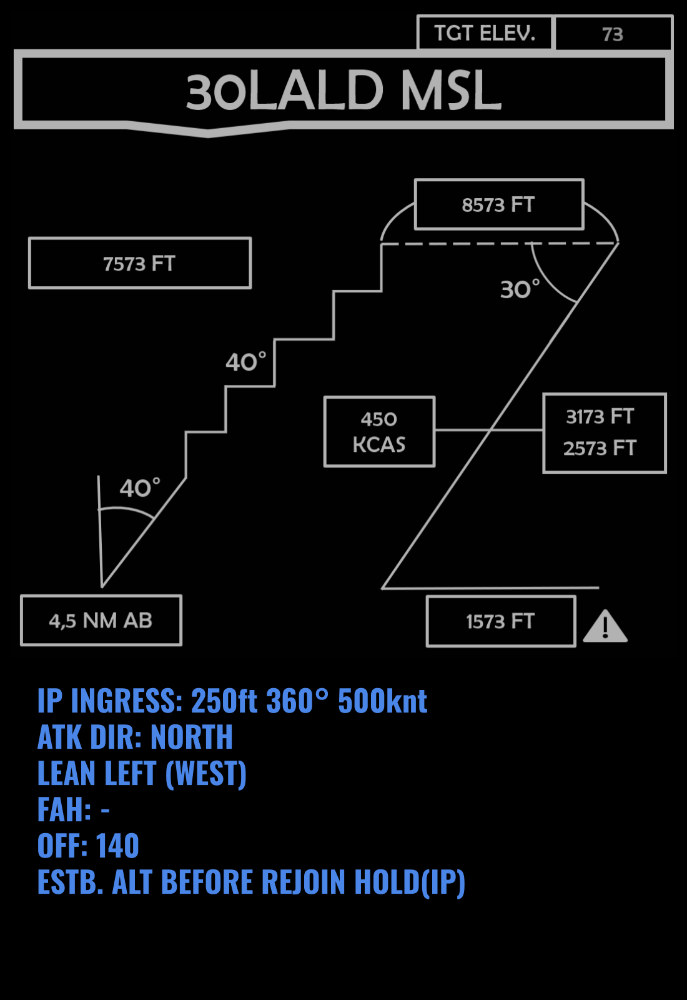

 |  | 
- | - | -
[VIPER START](/F16START.MD) | [FLIP GULF](https://www.dropbox.com/s/sp91zf63rx0esao/FLIP_GULFR2_EC1.pdf?dl=0) | [FLIP CAUCASUS](https://www.dropbox.com/s/ppiqy9ba7i8h8op/FLIP_CAUR_EC1.pdf?dl=0)

## NAME - MSN# - TIMEDATE

FL: 

WM: 

EL: 

EW: 

## FP

---  												
###	59	MADISON	N	26	51,000	  -  	E	056	39,000		GEOREF	
												
---  												
####	00	Al Dhafra AB									0 - 0	
#####  	FUEL:		12103		WALK:		07:00:00	T/O T:		07:20:00		
												
												
---  												
###	01	ROUTE	N	25	03,724	  -  	E	054	23,543			
#####	DIST:	048,9  NM	BINGO:	10783	ALT:		20.0 M	MACH:	0,7			
#####	HDG:	349°	GS:	435	ETE:		00:06:45	TOT:		07:26:45		
												
												
---  												
###	02	DECENT	N	25	46,801	  -  	E	054	30,172			
#####	DIST:	043,5  NM	BINGO:	10054	ALT:		20.0 M	MACH:	0,7			
#####	HDG:	006°	GS:	434	ETE:		00:06:01	TOT:		07:32:46		
												
												
---  												
###	03	INGRESS_NOE	N	26	23,518	  -  	E	054	36,525			
#####	DIST:	037,2  NM	BINGO:	9235	ALT:		0.2 A	MACH:	0,7			
#####	HDG:	007°	GS:	466	ETE:		00:04:47	TOT:		07:37:33		
												
												
---  												
###	04	IP	N	26	41,640	  -  	E	054	40,485			
#####	DIST:	018,5  NM	BINGO:	8828	ALT:		0.2 A	MACH:	0,7			
#####	HDG:	009°	GS:	468	ETE:		00:02:22	TOT:		07:39:55		
												
												
---  												
###	05	T7	N	26	36,927	  -  	E	054	55,187			
#####	DIST:	014,0  NM	BINGO:	8520	ALT:		0.1 M	MACH:	0,76			
#####	HDG:	108°	GS:	503	ETE:		00:01:40	TOT:		07:41:35		
												
												
---  												
###	06	EGRESS	N	26	24,508	  -  	E	055	10,778			
#####	DIST:	018,7  NM	BINGO:	8207	ALT:		20.0 A	MACH:	0,7			
#####	HDG:	130°	GS:	434	ETE:		00:02:35	TOT:		07:44:10		
												
												
---  												
###	07	MRR_TURN	N	25	37,592	  -  	E	056	05,102			
#####	DIST:	067,8  NM	BINGO:	7073	ALT:		20.0 A	MACH:	0,71			
#####	HDG:	132°	GS:	435	ETE:		00:09:21	TOT:		07:53:31		
												
												
---  												
###	08	MRR_SOUTH	N	24	32,548	  -  	E	055	12,803			
#####	DIST:	080,5  NM	BINGO:	5724	ALT:		20.0 A	MACH:	0,7			
#####	HDG:	215°	GS:	434	ETE:		00:11:08	TOT:		08:04:39		
												
												
---  												
###	09	OMAM_ELEV	N	24	24,419	  -  	E	054	54,020			
#####	DIST:	018,9  NM	BINGO:	5307	ALT:		5.0 A	MACH:	0,66			
#####	HDG:	243°	GS:	434	ETE:		00:02:37	TOT:		08:07:16		
												
												
---  												
###	10	Al Dhafra AB	N	24	15,433	  -  	E	054	32,050			
#####	DIST:	022,0  NM	BINGO:	4823	ALT:		1.5 A	MACH:	0,65			
#####	HDG:	244°	GS:	434	ETE:		00:03:02	TOT:		08:10:18		
												

				

## Objective
#### 

## LOADOUT

left | right
----- | -----
S1 - AIM120C | S9 - AIM120C
S2 - AIM-9X | S8 - AIM-9X
S3 - MK-84 | S7 - MK-84
S4 - TANK 370 | S6 - TANK 370
S5L - - | S5R - -
S5 - - | SGUN - SAPHEI
CHAFF - 60 | FLARE - 60

## STEERPOINTS

## METAR: 

#### NOTAM: 

## COMMS

## SPINS

### RAMROD

| 0 | 1 | 2 | 3 | 4 | 5 | 6 | 7 | 8 | 9 |
| - | - | - | - | - | - | - | - | - | - |
| B | L | A | C | K | H | O | R | S | E |
| L | U | M | B | E | R | J | A | C | K |
| C | O | M | P | L | E | X | I | T | Y |

### BASE

| ALTITUDE | SPEED | HEADING | NUMBER| 
| -------- | ----- | ------- | ----- | 
| 5000ft AMSL | 300 Kts | 300 degrees | 5 |

### CODEWORDS

| MEANING | CODEWORD | 
| ------- | -------- | 
| ON STATION | ALABAMA | 
| OFF STATION | BABYLON |
| RTB | CHICAGO |
| MISSION CANCEL | DENVER |
| MISSION SUCCESSFUL| ERIE |
| MISSION UNSUCCESSFUL| FRANKFURT |
| ATTACK SUCCESSFUL | GEORGIA |
| ATTACK UNSUCCESSFUL | HIGHLAND |
| LAST OFF TARGET| ILLINOIS |
| REATTACK | JAKARTA |
| PUSHING | KENTUCKY |
| ROLEX | LOUSVILLE |
| REQUEST ROLEX| MEMPHIS|
| WOUNDED BIRD | NANTUCKET |
| FEET WET | OHIO |
| FEET DRY | PHILIPPINES |

## TCN

## ROE:

## Intel:

## TASK

  
[FLIP GULF](https://www.dropbox.com/s/sp91zf63rx0esao/FLIP_GULFR2_EC1.pdf?dl=0)
[FLIP CAUCASUS](https://www.dropbox.com/s/ppiqy9ba7i8h8op/FLIP_CAUR_EC1.pdf?dl=0)

