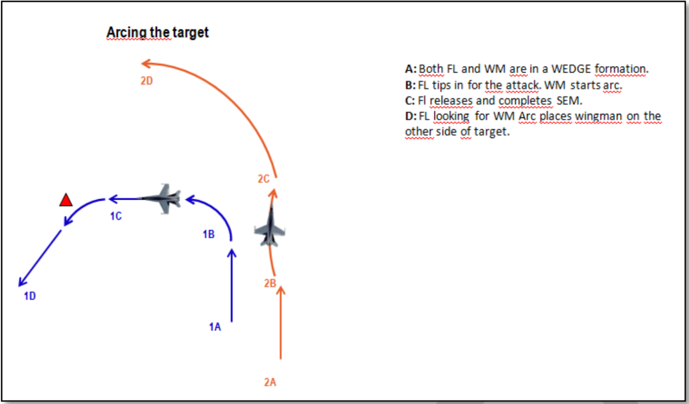
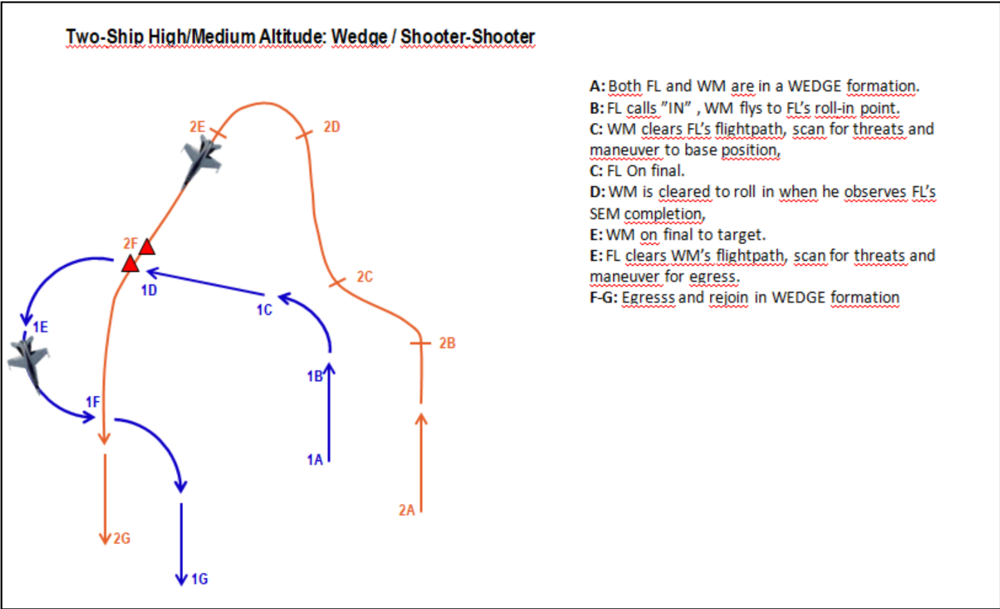

## PANTER 1 TR1442

FL: David

WM: Kimkiller

EL: Teddy

## FP
3xFA18, VFR EAST
Transit to RGN 4B for TAC-21
Recovery from East. 

## Objective

* Objective 1: Familiarization with cockpit cues/references for high/medium altitude weapon release.
* Objective 2: Familiarization with Z-charts.
* Objective 3: Use 40 High Altiude Dive Bomb Profile.
* Objective 4: High/medium altitude Shooter-Cover attack.
* Objective 5: High/medium altitude Shooter-Shooter attack.
* Objective 6: Utilizing Safe Escape Maneuver.
* Objective 7: Use 3-point attack brief

As a minimum conduct 1x high/medium altitude shooter-cover attack and 1x high/medium altitude shooter-shooter attack using the 40 HADB profile found in the 494th SAT document.
	
## LOADOUT

a | b
--------------- | ---------------
S1 - AN/ASQ-T50 | S9 - AIM-9X
S2 - MK-83 | S8 - MK-83
S3 - PFU-8A | S7 - PFU-8A
S4 - AIM7MH | S6 - AIM7MH
S5 - MK-84 | GUN - FULL CM
CHAFF - 50 | FLARE - 35
FUEL - 1 | WEIGHT: 47239

## STEERPOINTS

### 0 - KUTAISI - LA:  42 - 10 - 39 /// LO:  42 - 28 - 52
### 1 - BULLSEYE BLUE - LA:  41 - 11 - 14 /// LO:  43 - 10 - 19
### 3 - PARAVANI LAKE - LA:  41 - 26 - 27 /// LO:  43 - 48 - 42
### 4 - 424DMPI - LA:  41 - 36 - 29 /// LO:  44 - 7 - 29
### 5 - ALI/NDB - LA:  42 - 5 - 46 /// LO:  43 - 38 - 41
### 6 - KUTAISI - LA:  42 - 10 - 39 /// LO:  42 - 28 - 52
### 7 - VAZIANI - LA:  41 - 37 - 45 /// LO:  45 - 1 - 38

## TARGET DESC.

## SET 1

### FL/WM SHOOTER COVER ARC
### SINGLE MK 84 BY WM

## SET 2

### FL/WM SHOOTER COVER ARC
### SINGLE MK 84 BY FL

## SET 3

### FL/WM SHOOTER SHOOTER WEDGE
### DUAL MK 83 BY FL/WM

## SET 4

### EL/WM SHOOTER COVER ARC
### SINGLE MK 84 BY EL

## SET 5

### EL/WM SHOOTER SHOOTER WEDGE
### DUAL MK 83 BY EL, SIM BY WM

## COMMS

#### FL PRIMARY / PRI-1 / GREEN5 / 230.250 / AMPL:
#### FL SECONDARY / N/A / RED1 / 140.250 / AMPL:
#### CHECK IN / AUX-4 / BLUE3 / 237.0 / AMPL:EXPECT THRUOUT
#### RANGE 4B PRI / PRI-18 - AUX-18 / PINK7 / 234.750 / AMPL:
#### RANGE 4B SEC / N/A / PURPLE11 / 127.750 / AMPL:
#### RANGE CTR WIZ / AUX-9 / RED5 / 245.0 / AMPL:
#### IN FLT RPT / PRI-9 - AUX-8 / OCHRE9 / 234.0 / AMPL:
#### C2 BACKUP / N/A / INDIGO6 / 136.250 / AMPL:

	

## TASK
VTASK/132vW/21442/241800ZAPR2019//
TASKUNIT/494th/ICAO:-//
AMSNDAT/TR1442/TR/-/-/2/-/-/DEPLOC:UGKO/ARRLOC:UGKO//
MSNACFT/2/F/A-18C/PANTHER11-12/FLIGHT LEAD DISCRETION/-/GREEN5/RED1//
AMPN/F-18C FLIGHT//

## TRM Tanker info
KC-135 TEXACO:
11500ft, speed 270kts,TACAN 41Y.Freq: 151.0

KC-135 SHELL:\
12000ft, speed 270kts, TACAN 42Y, Freq: 149.0

KC-135_MPRS (Shell):
24000ft, speed 380kts, TACAN 38Y, Freq: 230.750

KC-130 (ARCO):
18000ft, speed 336kts, TACAN 39Y, Freq: 235.500

AGGRESSOR IL-78 (C/S 401)
18000ft, speed 336, TACAN 37Y, Freq: 244.25

S-3 VIKING Carrier alert Tanker (TEXACO 2)
8000ft, speed 380kts, TACAN 40Y, Freq: 242.0 (CHERRY 3)
