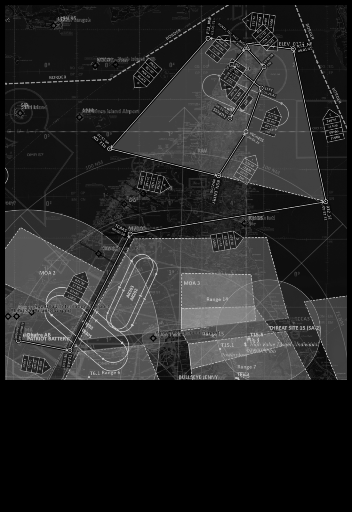

 |  | 
- | - | -
[CV-OPs](/CVOPS/cvops.md) | [FLIP GULF](https://www.dropbox.com/s/sp91zf63rx0esao/FLIP_GULFR2_EC1.pdf?dl=0) | [FLIP CAUCASUS](https://www.dropbox.com/s/ppiqy9ba7i8h8op/FLIP_CAUR_EC1.pdf?dl=0)

## VIPER 1 - TR4532

Flight Lead: DAVID   

## FLIGHTPLAN
"UGKS -TO  
PATTERN WORK UGKO"

## LOADOUT

left | right  
----- | -----
S1 - AIM120C | S9 - AIM120C
S2 - CAP-9M | S8 - AN/ASQ-T50
S3 - - | S7 - -
S4 - - | S6 - -
S5 - - | GUN - TP
CHAFF - 60 | FLARE - 60

## STEERPOINTS
###	59	0			,	  -  			,		GEOREF	
												
---  												
####	00	Senaki-Kolkhi									0 - 0	
#####  	FUEL:		10803		WALK:		18:00:00	T/O T:		18:20:00		
												
												
---  												
###	01	ALIKA		42	15,219	  -  		041	31,968			
#####	DIST:	023,5  NM	BINGO:	9451	ALT:		26.0 M	MACH:	0,8			
#####	HDG:	266°	GS:	486	ETE:		00:02:54	TOT:		18:22:54		
												
												
---  												
###	02	SARPI		41	32,978	  -  		041	26,859			
#####	DIST:	042,4  NM	BINGO:	8815	ALT:		26.0 M	MACH:	0,8			
#####	HDG:	179°	GS:	485	ETE:		00:05:15	TOT:		18:28:09		
												
												
---  												
###	03	MOUSE		41	20,669	  -  		041	41,232			
#####	DIST:	016,4  NM	BINGO:	8569	ALT:		26.0 M	MACH:	0,8			
#####	HDG:	133°	GS:	483	ETE:		00:02:02	TOT:		18:30:11		
												
												
---  												
###	04	DONALD		41	10,509	  -  		043	16,290			
#####	DIST:	072,2  NM	BINGO:	7487	ALT:		26.0 M	MACH:	0,8			
#####	HDG:	092°	GS:	485	ETE:		00:08:56	TOT:		18:39:07		
												
												
---  												
###	05	5		41	21,676	  -  		044	31,325			
#####	DIST:	057,5  NM	BINGO:	6624	ALT:		26.0 M	MACH:	0,8			
#####	HDG:	072°	GS:	484	ETE:		00:07:08	TOT:		18:46:15		
												
												
---  												
###	06	OBORA		41	50,059	  -  		044	27,884			
#####	DIST:	028,5  NM	BINGO:	6197	ALT:		26.0 M	MACH:	0,8			
#####	HDG:	349°	GS:	484	ETE:		00:03:32	TOT:		18:49:47		
												
												
---  												
###	07	GORI/NDB		42	01,000	  -  		044	07,934			
#####	DIST:	018,5  NM	BINGO:	5920	ALT:		26.0 M	MACH:	0,8			
#####	HDG:	300°	GS:	485	ETE:		00:02:17	TOT:		18:52:04		
												
												
---  												
###	08	ALI/NDB		42	05,767	  -  		043	38,683			
#####	DIST:	022,2  NM	BINGO:	5587	ALT:		26.0 M	MACH:	0,8			
#####	HDG:	276°	GS:	485	ETE:		00:02:45	TOT:		18:54:49		
												
												
---  												
###	09	LOBIN		42	10,955	  -  		043	06,348			
#####	DIST:	024,5  NM	BINGO:	5090	ALT:		10.0 M	MACH:	0,64			
#####	HDG:	276°	GS:	413	ETE:		00:03:34	TOT:		18:58:23		
												
												
---  												
###	10	Kutaisi		42	10,733	  -  		042	29,733			
#####	DIST:	027,2  NM	BINGO:	4492	ALT:		1.5 A	MACH:	0,8			
#####	HDG:	264°	GS:	531	ETE:		00:03:04	TOT:		19:01:27		
												

## COMMS

#### FL PRIMARY / - / AMBER3 / 227.0 / AMPN:PROGRAM
#### FL SECONDARY / - / BLUE6 / 118.500 / AMPN:PROGRAM
#### CHECK IN / - / BLUE3 / 237.0 / AMPN:PROGRAM
#### KUTAISI TWR / - / KUTAISI TWR / 134.200 / AMPN:PROGRAM
#### KUTAISI CRTL / - / RED4 / 127.100 / AMPN:PROGRAM
#### UGKS TWR / - / UGKS TWR / 132.200 / AMPN:PROGRAM
#### RANGE 2A PRI / - / INDIGO4 / 239.750 / AMPN:PROGRAM
#### RANGE 3A PRI / - / INDIGO10 / 225.750 / AMPN:PROGRAM
#### RANGE 3B PRI / - / AMBER4 / 235.750 / AMPN:PROGRAM
#### MOA C / - / ORANGE2 / 242.250 / AMPN:PROGRAM
#### MOTHER / - / AQUA6 / 247.750 / AMPN:PROGRAM
#### RANGE CTR WIZ / - / RED5 / 245.0 / AMPN:PROGRAM
#### C2 BACKUP / - / INDIGO6 / 136.250 / AMPN:PROGRAM

## SPINS

### RAMROD

| 0 | 1 | 2 | 3 | 4 | 5 | 6 | 7 | 8 | 9 |
| - | - | - | - | - | - | - | - | - | - |
| C | O | M | P | L | E | X | I | T | Y |

### BASE

| ALTITUDE | SPEED | HEADING | NUMBER| 
| -------- | ----- | ------- | ----- | 
| 5000ft AMSL | 300 Kts | 300 degrees | 5 |

### CODEWORDS

| MEANING | CODEWORD | 
| ------- | -------- | 
| ON STATION | ALABAMA | 
| OFF STATION | BABYLON |
| RTB | CHICAGO |
| MISSION CANCEL | DENVER |
| MISSION SUCCESSFUL| ERIE |
| MISSION UNSUCCESSFUL| FRANKFURT |
| ATTACK SUCCESSFUL | GEORGIA |
| ATTACK UNSUCCESSFUL | HIGHLAND |
| LAST OFF TARGET| ILLINOIS |
| REATTACK | JAKARTA |
| PUSHING | KENTUCKY |
| ROLEX | LOUSVILLE |
| REQUEST ROLEX| MEMPHIS|
| WOUNDED BIRD | NANTUCKET |
| FEET WET | OHIO |
| FEET DRY | PHILIPPINES |

## TCN

## ROE:

## Intel:

## TASK

  
[FLIP GULF](https://www.dropbox.com/s/sp91zf63rx0esao/FLIP_GULFR2_EC1.pdf?dl=0)
[FLIP CAUCASUS](https://www.dropbox.com/s/ppiqy9ba7i8h8op/FLIP_CAUR_EC1.pdf?dl=0)

