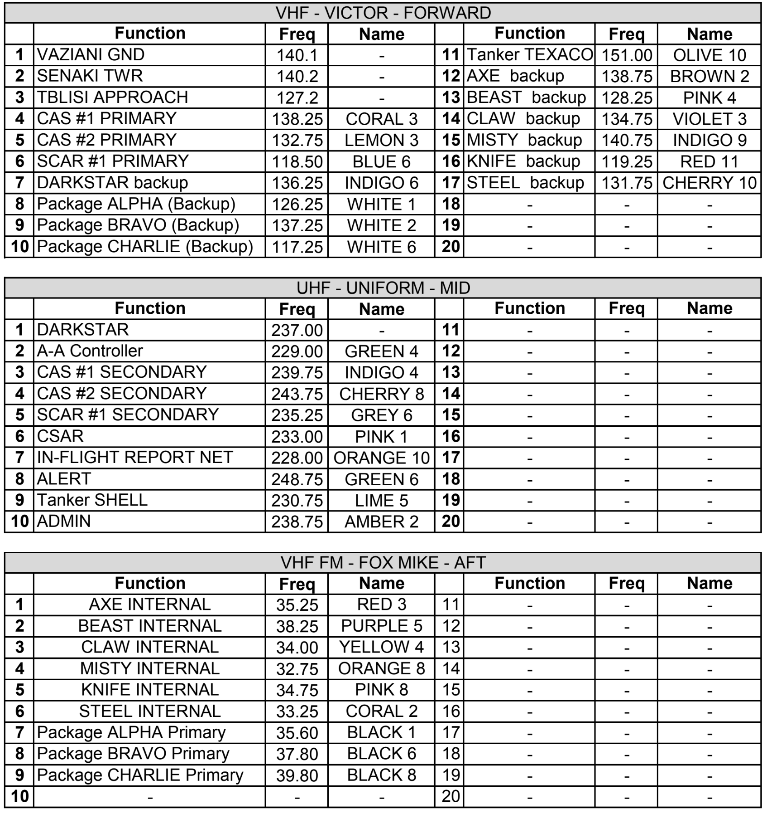

## JEDI 4

FL: David

WM: Magri

## FP
-

## Objective

INTELLIGENCE UPDATE ALPHA:
OLA (Ossetian Liberation Army) front
1. We recognize an increased level activity in OLA's South-Eastern area:
2. Based on OLA's observe deployment in the past week, and radio intercepts we estimate OLA is preparing for an offensive move.
3. Known ENY deployments:
....a. Mechanized infantry platoons at the city of GORI (1x platoon) and IVO 
objectives CINDY, BROOKE (1x platoon each). 
....b. Main battle tanks platoon at BROOKE
....c. Artillery (mortar) groups at GORI and KASPI (several teams at each)
....d. Anti-air threats (Known): 
.......SA8 ALEXA-NORTH
.......SA8 on ridge NE of GORI (Estimated position)
.......SA13s and SHILKAs are to be expected with ENY mobile forces

Based on the above we expect ENY to execute ONE of the following:
1. Attack IVO KASPI, possibly to seize KASPI outposts
2. Attack into HIDISTAVI (just SOUTH of GORI)
3. Attack the villages of KARELI and AGARA

We expect to firm up our estimate SUNDAY afternoon.

We have recon teams VIPER and ROBBER inserted into OLA territory two nights ago for intl' gathering and recon.
Each team inserted with 2x HMMWV's to following locations:
ROBBER N42 01.800 E044 03.000 ELEV.2830(Hill slope,NW of GORI)
VIPER N41 59.300 E044 21.850 ELEV.3060 (On ridge, at treeline WEST of IGOETI)

NFZ (No-Fire-Zone) are in effect 1nm around each of the SOF's . 
Attacks IVO GORI are to be coordinated with ROBBER.

RUSSIAN FRONT:
An airlift of C-17s is planned to land the US 82nd' airborne division at KUTAISI later today (arriving from SW for direct approach).
RUS airforce on elevated alert and has gathered strike assets to MAYKOP and MOZDOK. We suspect and attempt will be made to strike allied western airbases of SENAKI, KUTAISI , KOBULETI to disrupt the airlift.

132nd TASKING draft BRAVO:
AXE1 - Strike road bridges to disrupt ENY manuevers / AR/CAS supporting BEAST 
BEAST2 - SCAR / FAC(A) flight to suppress ENY forces and support allied defenses
CLAW3 - AR/CAS supporting BEAST
DRAGON2 - AR/CAS supporting BEAST
GRIZZLY2 : Troops delivery to reinforce allied outposts along the border between KASPI and AGARA
(Pickups from VAZIANI and/or from FARPs); CASEVAC as needed
FALCON2: SEAD supporting 132nd assets / CAP defending allied western airbases
	
## LOADOUT

left | right
----- | -----
S1 - AN/ASQ-T50 | S9 - AIM-9X
S2 - GBU-38 | S8 - GBU-38
S3 - 2xMK-82 LD | S7 - 2xMK-82 LD
S4 - AIM7MH | S6 - AIM7MH
S5 - PFU-8A | GUN - FULL CM
CHAFF - 50 | FLARE - 35
FUEL - 1 | WEIGHT: 44299

## STEERPOINTS

### BULLS 42 14 954, 042 42 033 - Kutaisi city

### 0 - KUTAISI - LA:  42 - 10 - 39 /// LO:  42 - 28 - 52
### 1 - BULLSEYE BLUE - LA:  41 - 11 - 14 /// LO:  43 - 10 - 19
### 2 - ALI/NDB - LA:  42 - 5 - 46 /// LO:  43 - 38 - 41
### 3 - PARAVANI LAKE - LA:  41 - 26 - 27 /// LO:  43 - 48 - 42
### 4 - 424DMPI - LA:  41 - 36 - 29 /// LO:  44 - 7 - 29
### 5 - ALI/NDB - LA:  42 - 5 - 46 /// LO:  43 - 38 - 41
### 6 - KUTAISI - LA:  42 - 10 - 39 /// LO:  42 - 28 - 52
### 7 - VAZIANI - LA:  41 - 37 - 45 /// LO:  45 - 1 - 38

## TARGET DESC.

### JDAM DMPI 1
### 41° 36′ 30.33″ N, 044° 07′ 30.88″ E

### JDAM DMPI 2
### 41° 36′ 28.96″ N, 044° 07′ 30.55″ E

## CONTRACT

## COMMS

	

## TASK
VTASK/132vW/21588/121800ZMAY2019//
TASKUNIT/617th/ICAO:UG27//
AMSNDAT/CG1588/GCAS/GAR/-/465/15MIN/-/DEPLOC:UG27/ARRLOC:UG27//
MSNACFT/2/A-10C/AXE11-12/-/-/RED3/BROWN2//

## TRM Tanker info
KC-135 TEXACO:
11500ft, speed 270kts,TACAN 41Y.Freq: 151.0

KC-135_MPRS (Shell):
24000ft, speed 380kts, TACAN 38Y, Freq: 230.750
