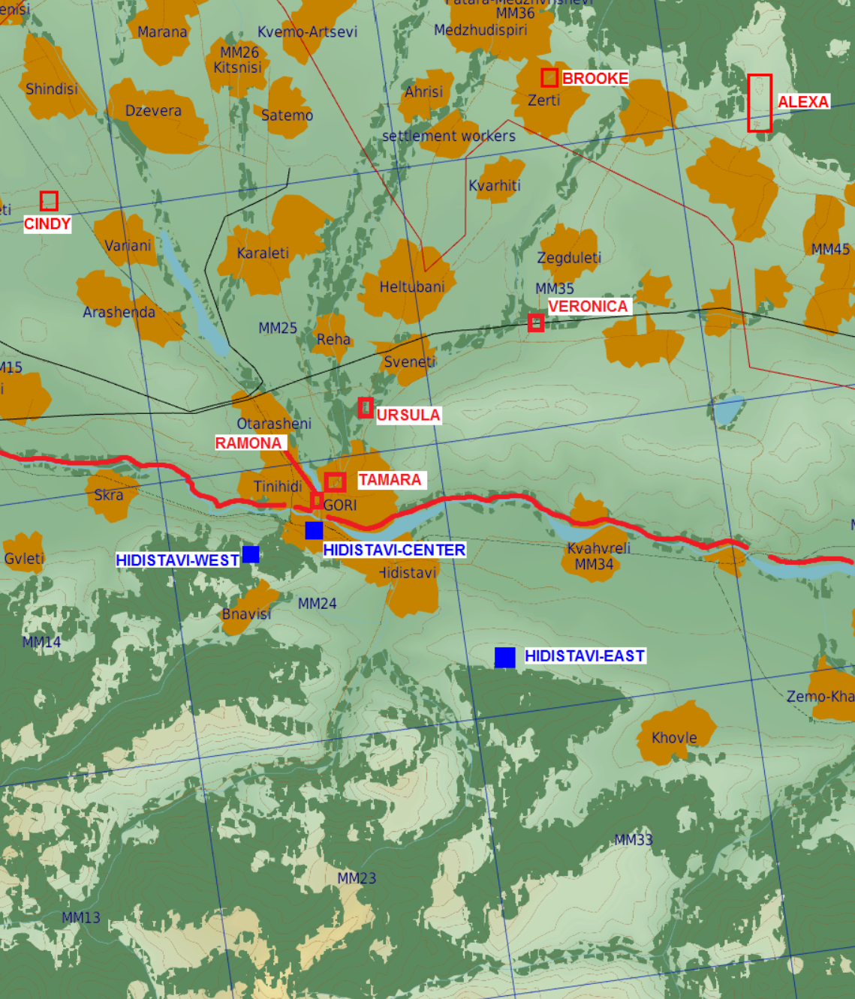
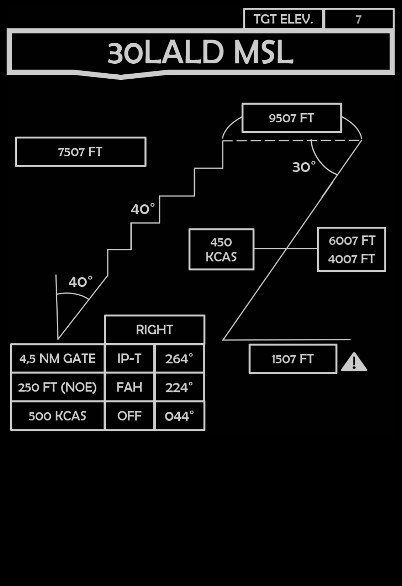

 |  | 
- | - | -
[VIPER START](/F16START.MD) | [FLIP GULF](https://www.dropbox.com/s/sp91zf63rx0esao/FLIP_GULFR2_EC1.pdf?dl=0) | [FLIP CAUCASUS](https://www.dropbox.com/s/ppiqy9ba7i8h8op/FLIP_CAUR_EC1.pdf?dl=0)

## WOOKIE 2 - TR5933

Flight Lead: TROLLEF  
WM2: DAVID  
Element Lead:   
WM4:   
TACAN: 63 - 126Y  

## LOADOUT

left | right
----- | -----
S1 - AIM120B | S9 - AIM120B
S2 - - | S8 - -
S3 - 3xMK-82Y | S7 - 3xMK-82Y
S4 - TANK 370 | S6 - TANK 370
S5L - - | S5R - -
S5 - - | SGUN - SAPHEI
CHAFF - 60 | FLARE - 60

## FP

Standard dept, direct TCAA3 FL200  
Transit corridor BEDA for Range 10  
AI training Range 10, FL ground to 200  
Transit corridor BEDA FL200  
AAR ARCO   
RTB via TCAA3  
OHB recovery	  					
						

## Objective
#### 

## STEERPOINTS

---  												
###	59	NAOMI	N	26	10,309	  -  	E	056	14,516		GEOREF	
												
---  												
####	00	Al Dhafra AB									0 - 0	
#####  	FUEL:		12103		WALK:		08:00:00	T/O T:		08:20:00		
												
												
---  												
###	01	TCAA3	N	23	47,903	  -  	E	054	43,480			
#####	DIST:	029,5  NM	BINGO:	11110	ALT:		20.0 M	MACH:	0,75			
#####	HDG:	158°	GS:	469	ETE:		00:03:46	TOT:		08:23:46		
												
												
---  												
###	02	2	N	23	48,261	  -  	E	056	23,324			
#####	DIST:	091,4  NM	BINGO:	9578	ALT:		20.0 M	MACH:	0,76			
#####	HDG:	088°	GS:	471	ETE:		00:11:38	TOT:		08:35:24		
												
												
---  												
###	03	3	N	23	25,250	  -  	E	057	02,071			
#####	DIST:	042,3  NM	BINGO:	8869	ALT:		20.0 M	MACH:	0,77			
#####	HDG:	122°	GS:	476	ETE:		00:05:20	TOT:		08:40:44		
												
												
---  												
###	04	4	N	23	05,941	  -  	E	057	16,632			
#####	DIST:	023,5  NM	BINGO:	8351	ALT:		0.3 A	MACH:	0,72			
#####	HDG:	144°	GS:	475	ETE:		00:02:58	TOT:		08:43:42		
												
												
---  												
###	05	DMPI 1	N	22	48,817	  -  	E	057	15,190			
#####	DIST:	017,2  NM	BINGO:	7973	ALT:		1.5 M	MACH:	0,72			
#####	HDG:	183°	GS:	476	ETE:		00:02:10	TOT:		08:45:52		
####	ELEV 1509											
												
---  												
###	06	6	N	23	10,689	  -  	E	057	02,148			
#####	DIST:	025,0  NM	BINGO:	7423	ALT:		0.3 A	MACH:	0,72			
#####	HDG:	330°	GS:	476	ETE:		00:03:09	TOT:		08:49:01		
												
												
---  												
###	07	7	N	23	48,487	  -  	E	056	17,464			
#####	DIST:	055,8  NM	BINGO:	6488	ALT:		20.0 M	MACH:	0,75			
#####	HDG:	311°	GS:	468	ETE:		00:07:09	TOT:		08:56:10		
												
												
---  												
###	08	TCAA3	N	23	47,903	  -  	E	054	43,480			
#####	DIST:	086,0  NM	BINGO:	5047	ALT:		20.0 M	MACH:	0,76			
#####	HDG:	268°	GS:	471	ETE:		00:10:57	TOT:		09:07:07		
												
												
---  												
###	09	Al Dhafra AB	N	24	15,433	  -  	E	054	32,050			
#####	DIST:	029,5  NM	BINGO:	4398	ALT:		0.1 A	MACH:	300			
#####	HDG:	338°	GS:	303	ETE:		00:05:50	TOT:		09:12:57		
												

## METAR: 

#### NOTAM: 

## COMMS

#### FL PRIMARY / - / BROWN6 / 232.0 / AMPN:PROGRAM
#### FL SECONDARY / - / VIOLET7 / 130.750 / AMPN:PROGRAM
#### AL DAHFRA GND / - / LIME2 / 126.100 / AMPN:0
#### AL DAHFRA TWR / - / AL DAHFRA TWR / 126.200 / AMPN:0
#### AL DAHFRA TMA / - / RED4 / 127.100 / AMPN:0
#### CHECK IN / - / BLUE3 / 237.0 / AMPN:DARKSTAR
#### ATR PRI RANGE 10 / - / RED5 / 245.0 / AMPN:0
#### ARCO AR201 / - / OLIVE10 / 151.000 / AMPN:0
#### ATR IN FLT RPT / - / OCHRE9 / 234.0 / AMPN:0
#### Liwa TWR / - / Liwa TWR / 119.600 / AMPN:DIVERT. RGN 4
#### Liwa ATIS / - / Liwa ATIS / 119.700 / AMPN:0
#### Al Ain TWR / - / Al Ain TWR / 119.200 / AMPN:DIVERT. RGN 7
#### Al Ain ATIS / - / Al Ain ATIS / 119.400 / AMPN:0

## SPINS

### RAMROD

| 0 | 1 | 2 | 3 | 4 | 5 | 6 | 7 | 8 | 9 |
| - | - | - | - | - | - | - | - | - | - |
| L | U | M | B | E | R | J | A | C | K |

### BASE

| ALTITUDE | SPEED | HEADING | NUMBER| 
| -------- | ----- | ------- | ----- | 
| 5000ft AMSL | 300 Kts | 300 degrees | 5 |

### CODEWORDS

| MEANING | CODEWORD | 
| ------- | -------- | 
| ON STATION | ALABAMA | 
| OFF STATION | BABYLON |
| RTB | CHICAGO |
| MISSION CANCEL | DENVER |
| MISSION SUCCESSFUL| ERIE |
| MISSION UNSUCCESSFUL| FRANKFURT |
| ATTACK SUCCESSFUL | GEORGIA |
| ATTACK UNSUCCESSFUL | HIGHLAND |
| LAST OFF TARGET| ILLINOIS |
| REATTACK | JAKARTA |
| PUSHING | KENTUCKY |
| ROLEX | LOUSVILLE |
| REQUEST ROLEX| MEMPHIS|
| WOUNDED BIRD | NANTUCKET |
| FEET WET | OHIO |
| FEET DRY | PHILIPPINES |

## TCN

63 - 126Y  

## ROE:

## Intel:

## TASK

  
[FLIP GULF](https://www.dropbox.com/s/sp91zf63rx0esao/FLIP_GULFR2_EC1.pdf?dl=0)
[FLIP CAUCASUS](https://www.dropbox.com/s/ppiqy9ba7i8h8op/FLIP_CAUR_EC1.pdf?dl=0)

